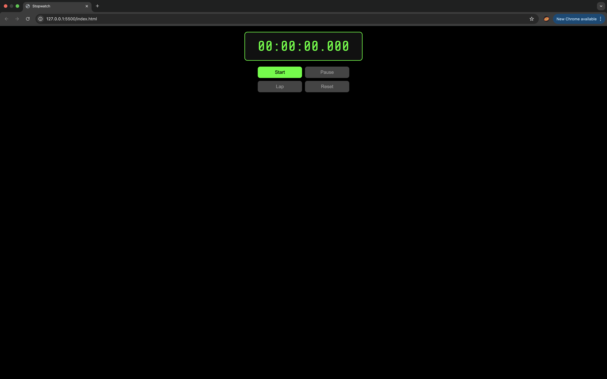

# Stopwatch

## Description
HTML, CSS, JavaScript를 활용하여 스탑워치 제작

## 기능
- 시간 측정(시작/일시정지/초기화)
- 시간 기록

## How To Use
1) repository 다운받기
```
git clone https://github.com/cogito30/js_stopwatch2.git
```
2) index.html를 브라우저로 열기

## Result

