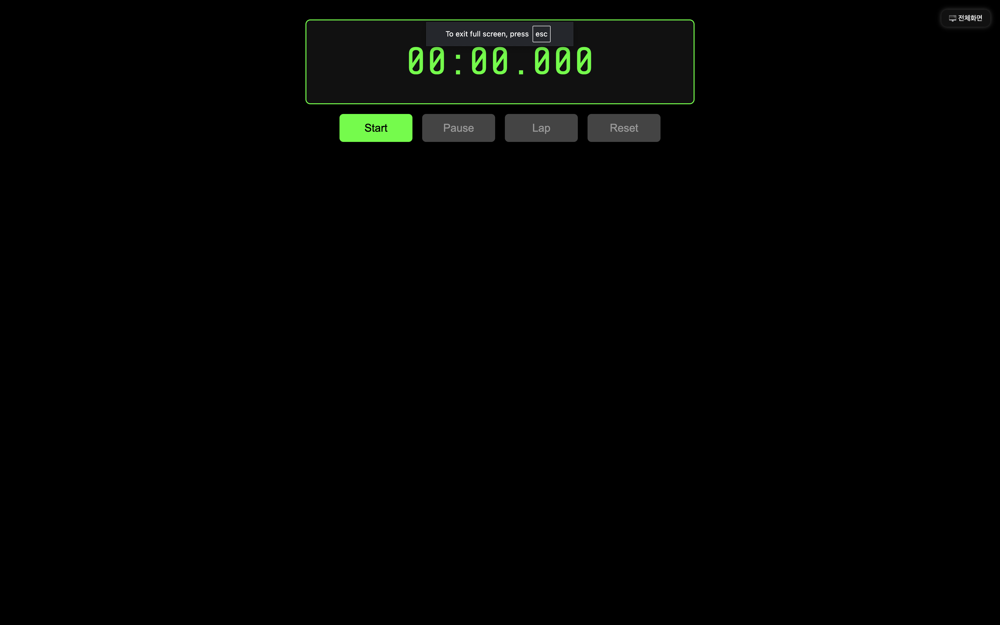

# Stopwatch

## Description
HTML, CSS, JavaScript를 활용하여 스탑워치 제작

## 기능
- [v1](./stopwatch_v1/): 기본 스톱워치, 기록 저장 및 다운로드
- [v2](./stopwatch_v2/): LED 스톱워치, 기록 저장

## How To Use
1) repository 다운받기
```
git clone https://github.com/cogito30/js_stopwatch.git
```
2) index.html를 브라우저로 열기

## Result

